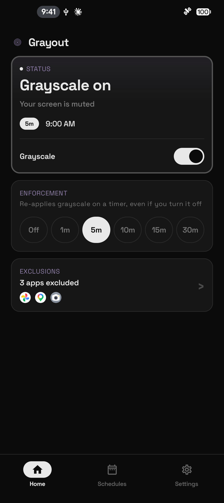
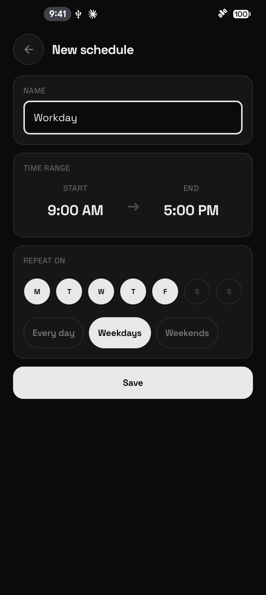
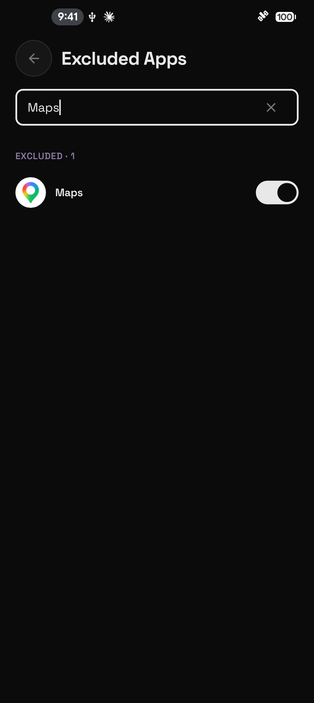

# Grayout

A personal Android app that enforces grayscale mode to reduce phone addiction.

## What It Does

- Toggle grayscale on/off with a single tap
- Automatic enforcement on a timer so grayscale turns back on after you disable it
- Per-app exclusions so specific apps stay in color
- Schedule grayscale for specific days and time windows
- Quick Settings tiles for fast access
- Runs as a foreground service using `WRITE_SECURE_SETTINGS` to control display settings

## Screenshots and demo

<p>
  
  
  
</p>

[Watch the app walkthrough (MP4)](https://github.com/Princeyadav05/Grayout/releases/download/v1.2.0/grayout-demo-v1.2.0.mp4)

Captured from v1.2.0 on a OnePlus 9 Pro running Android 16, using sample settings. These captures show the app interface; the phone's display-level grayscale effect is not reproduced in the screenshots or recording.

## Requirements

- Android 8.0+ (API 26)
- One-time ADB setup for the secure settings permission

## Install

Download the `.apk` file from the [latest GitHub release](https://github.com/Princeyadav05/Grayout/releases/latest) and open it on your Android device to install.

After installing, complete the [one-time ADB setup](#setup) below to enable grayscale control.

### Install from your computer with ADB

If you already have ADB set up, you can install the downloaded APK from your computer:

```bash
adb install grayout-v*.apk
```

Then grant the permission described in [Setup](#setup).

### Verify the download

You can verify the download:

```bash
shasum -a 256 grayout-v*.apk
```

Match the output against the `.sha256` file attached to the release. On Linux, `sha256sum` works the same way.

## Setup

After installing, grant the secure settings permission via ADB:

1. Enable USB debugging in **Settings > Developer Options**
2. Connect your device via USB and authorize the computer when prompted
3. Run:
   ```bash
   adb shell pm grant com.princeyadav.grayout android.permission.WRITE_SECURE_SETTINGS
   ```
4. Open the app

This is a one-time step. The permission persists across reboots and app updates.

### OnePlus / OPPO / Realme devices

These devices block ADB from granting permissions by default. If you get this error:

```
SecurityException: grantRuntimePermission: Neither user 2000 nor current process
has android.permission.GRANT_RUNTIME_PERMISSIONS
```

You need to enable an extra toggle first:

1. Go to **Settings > Additional Settings > Developer Options**
2. Scroll down to the **Apps** section
3. Enable **"Disable Permission Monitoring"**
4. Toggle **USB Debugging** off, then back on
5. **Reboot your phone**
6. Reconnect USB, re-authorize the computer if prompted
7. Run the `adb shell pm grant` command above

The toggle may also be called **"USB debugging (Security settings)"** depending on your OxygenOS/ColorOS version. The reboot after enabling it is required.

## Permissions

Grayout runs entirely on-device. It has no network access and sends nothing off your phone. Here is what each permission is for:

- **WRITE_SECURE_SETTINGS**: the core one. Lets the app switch the system grayscale (daltonizer) on and off. Granted once via ADB (see Setup).
- **QUERY_ALL_PACKAGES**: to show your installed apps in the per-app exclusion picker, so you can pick which apps stay in color. The list is read locally and never sent anywhere.
- **PACKAGE_USAGE_STATS**: to detect which app is in the foreground, so grayscale can pause while you are in an excluded app and resume when you leave it. Only the latest foreground app is retained, on-device.
- **FOREGROUND_SERVICE** and **FOREGROUND_SERVICE_SPECIAL_USE**: to run the background service that enforces grayscale and watches for excluded apps.
- **POST_NOTIFICATIONS**: for the ongoing notification the foreground service requires.
- **SCHEDULE_EXACT_ALARM** (Android 12 only) and **USE_EXACT_ALARM**: to fire schedule and enforcement events at the right time, even in Doze.
- **RECEIVE_BOOT_COMPLETED**: to restore your enforcement and schedules after a reboot.
- **REQUEST_IGNORE_BATTERY_OPTIMIZATIONS**: optional, so the service is not killed under battery optimization.

## Tech

- Kotlin
- Jetpack Compose
- Material 3
- Single-activity MVVM architecture
- Foreground Service

## Building from source

```bash
./gradlew assembleDebug   # debug build for local dev
```

For the release build process, see [RELEASING.md](RELEASING.md).

## License

MIT
